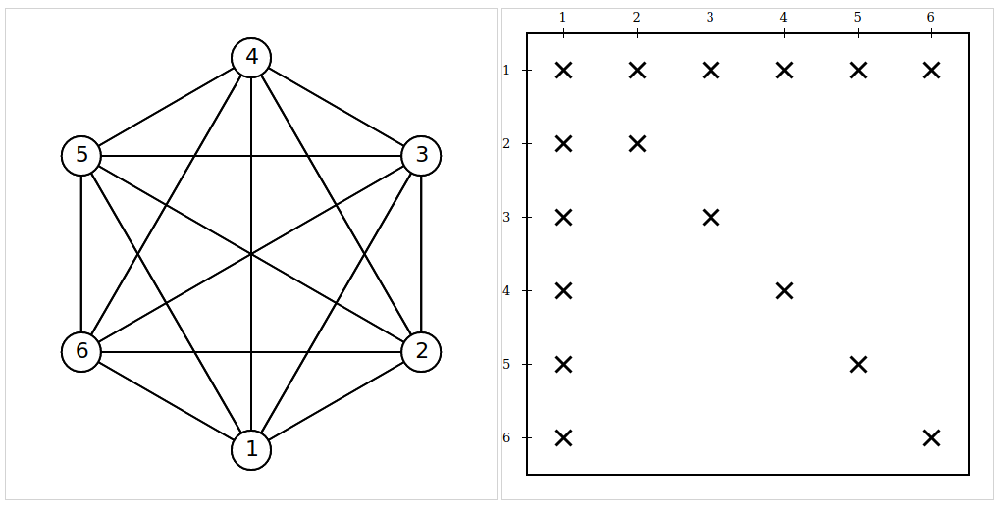
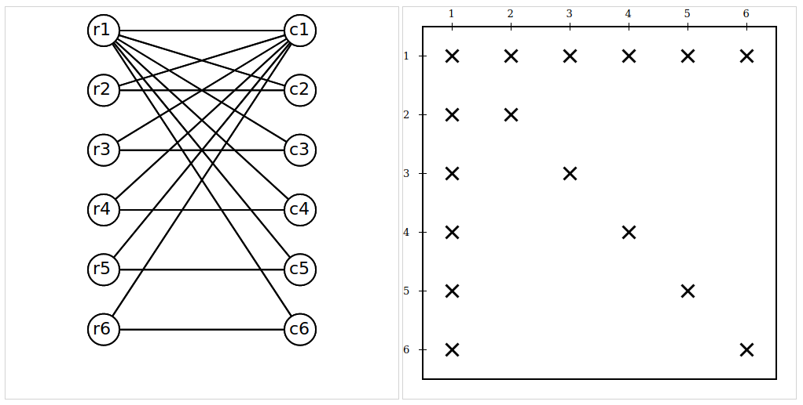

# Test matrices

### Column-intersection Graph vs Bipartite Graph
To understand the bipartite vs column-intersection graph models, 
let's consider the arrow shaped matrix, in which the first row, 
the first column and the main diagonal are filled with nonzero
elements and the other elements are zeros.

- arrow-shaped.mtx
- arrow-shaped_plus_one.mtx (from [Lülfesmann's dissertation](https://cuvillier.de/de/shop/publications/15-full-and-partial-jacobian-computation-via-graph-coloring-algorithms-and-applications)
)

- arrow-shaped_plus_one_minus_one.mtx (from [Lülfesmann's dissertation](https://cuvillier.de/de/shop/publications/15-full-and-partial-jacobian-computation-via-graph-coloring-algorithms-and-applications)
)

