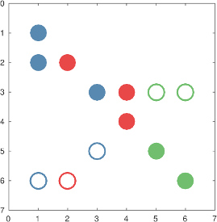

[](https://github.com/rostam/PreCol/actions/workflows/cmake.yml)
[](https://rostam.github.io/PreCol/index.html)

# PreCol



**PreCol** implements graph coloring heuristics for **partial Jacobian computation and preconditioning** in sparse matrix computations. Matrices are modeled as bipartite graphs, column-intersection graphs (CIG), or column-gain graphs and then colored to minimize the number of matrix-vector products needed to recover their nonzero entries.

Based on the dissertation work [[1]](#1)[[2]](#2)[[3]](#3).

---

## Contents

1. [Quick Start](#quick-start)
2. [Coloring Algorithms](#coloring-algorithms)
3. [Usage](#usage)
4. [Extending PreCol](#extending-precol)
5. [Graph API](#graph-api)
6. [Repository Structure](#repository-structure)
7. [Applications](#applications)
8. [References](#references)

---

## Quick Start

### 1. Install dependencies

```bash
sudo apt-get install build-essential libboost-all-dev libmetis-dev metis
```

Requires: GCC/Clang with C++20, Boost, OpenMP.

### 2. Build

```bash
# Release build (recommended for benchmarking)
mkdir mybuild && cd mybuild
cmake -DCMAKE_BUILD_TYPE=Release ..
make -j$(nproc)

# Debug build
cmake -DCMAKE_BUILD_TYPE=Debug ..
make -j$(nproc)
```

This produces four binaries in `mybuild/`:

| Binary | Purpose |
|--------|---------|
| `PreCol` | Main coloring CLI |
| `Application` | ILU preconditioning application |
| `ColumnGain` | Column-gain graph coloring |
| `BoostTest` | Unit test suite |

### 3. Run a quick example

```bash
cd mybuild
./PreCol D2Columns LargestFirstOrderingDegrees_NaturalOrdering Best 1.0 Full 0 0 0 \
    ../ExampleMatrices/FloridaSparseMatrixCollection/bcsstk01.mtx
```

Results are written to `OutputFile.csv`.

### 4. Run the tests

```bash
cd mybuild
./BoostTest                                    # all test suites
./BoostTest --run_test=ArrowShapedTest         # single suite
./BoostTest --list_content                     # list all suites
```

---

## Coloring Algorithms

Algorithms are organized by graph model (one-sided vs. two-sided) and scope (full vs. partial/restricted):

| # | Algorithm | Type | Reference |
|---|-----------|------|-----------|
| 1 | `CIG` | Full, one-sided | column-intersection graph coloring |
| 2 | `D2Columns` | Full, one-sided | distance-2 coloring for columns (Alg. 3.1 [[1]](#1)) |
| 3 | `D2Rows` | Full, one-sided | distance-2 coloring for rows (Alg. 3.1 [[1]](#1)) |
| 4 | `D2RestrictedColumns` | Partial, one-sided | restricted distance-2 for columns (Alg. 3.1 [[1]](#1)) |
| 5 | `D2RestrictedRows` | Partial, one-sided | restricted distance-2 for rows (Alg. 3.1 [[1]](#1)) |
| 6 | `D2RestrictedColumnsNonReq` | Partial, one-sided | includes non-required elements (Alg. 3.2 [[1]](#1)) |
| 7 | `PartialD2RestrictedColumnsNonReqDiag` | Partial, one-sided | includes diagonal elements (Alg. 3.2 [[1]](#1)) |
| 8 | `D2RestrictedColumnsNonReqBalanced` | Partial, one-sided | balanced variant of #6 (Alg. 3.5 [[1]](#1)) |
| 9 | `SBSchemeCombinedVertexCoverColoring` | Full, two-sided | star bicoloring (Alg. 3.6 [[1]](#1)) |
| 10 | `SBSchemeCombinedVertexCoverColoringRestricted` | Partial, two-sided | restricted star bicoloring (Alg. 3.6 [[1]](#1)) |
| 11 | `SBSchemeCombinedVertexCoverColoringRestrictedNonReq` | Partial, two-sided | with non-required elements (Alg. 3.7 [[1]](#1)) |
| 12 | `SBSchemeCombinedVertexCoverColoringRestrictedDiag` | Partial, two-sided | diagonal variant (Alg. 3.8 [[1]](#1)) |
| 13 | `MaxGain` | Full, one-sided | maximize gain (CIG model, [[3]](#3)) |
| 14 | `MaxDiscovered` | Full, one-sided | maximize discovered elements (CIG model, [[3]](#3)) |

**Summary table:**

| | Full | Partial |
|---|---|---|
| One-sided | 1, 2, 3, 13, 14 | 4, 5, 6, 7, 8 |
| Two-sided | 9 | 10, 11, 12 |

---

## Compiling and Running

### CLI — single matrix

The full positional syntax is:

```
./PreCol <Algorithm> <Ordering> <ISAlgorithm> <Rho> <Sparsify> <BlockSize> <Level> <Alpha> <matrix.mtx>
```

**Positional arguments (all required):**

| # | Argument | Possible values | Notes |
|---|----------|-----------------|-------|
| 1 | `Algorithm` | any name from the [algorithm table](#coloring-algorithms) | e.g. `D2Columns` |
| 2 | `Ordering` | `<ColoringOrdering>_<PreconditioningOrdering>` | two orderings joined by `_` — see below |
| 3 | `ISAlgorithm` | `Best`, `Variant` | independent-set algorithm variant |
| 4 | `Rho` | float, e.g. `1.0` | ratio ρ for the independent-set algorithm |
| 5 | `Sparsify` | `Full`, `Diagonal`, `BlockDiagonal` | sparsification method |
| 6 | `BlockSize` | integer | block size for `BlockDiagonal`; use `0` otherwise |
| 7 | `Level` | integer | ILU elimination level; use `0` for no ILU |
| 8 | `Alpha` | integer | α parameter for balanced coloring (`D2RestrictedColumnsNonReqBalanced`); use `0` otherwise |
| 9 | `matrix.mtx` | path to a Matrix Market `.mtx` file | |

**`<Ordering>` format:** combine the coloring ordering and the preconditioning ordering with an underscore:

```
LargestFirstOrderingDegrees_NaturalOrdering
SLO_NaturalOrdering
NaturalOrdering_NaturalOrdering
```

Available ordering names: `NaturalOrdering`, `LargestFirstOrderingDegrees`, `SLO`, `IDO`, `WeightOptimumOrdering`.  
`AGO` is additionally available as the coloring ordering for `MaxGain` and `MaxDiscovered`.

**Examples:**

```bash
# Distance-2 column coloring, largest-first ordering, no sparsification
./PreCol D2Columns LargestFirstOrderingDegrees_NaturalOrdering Best 1.0 Full 0 0 0 \
    ../ExampleMatrices/FloridaSparseMatrixCollection/bcsstk01.mtx

# Partial restricted coloring with block-diagonal sparsification (block size 30, ILU level 2)
./PreCol D2RestrictedColumns LargestFirstOrderingDegrees_NaturalOrdering Best 1.0 BlockDiagonal 30 2 0 \
    ../ExampleMatrices/FloridaSparseMatrixCollection/bcsstk18.mtx

# Star bicoloring (two-sided, full)
./PreCol SBSchemeCombinedVertexCoverColoring NaturalOrdering_NaturalOrdering Best 1.5 Full 0 0 0 \
    ../ExampleMatrices/FloridaSparseMatrixCollection/cant.mtx

# Balanced non-required coloring with alpha=3
./PreCol D2RestrictedColumnsNonReqBalanced LargestFirstOrderingDegrees_NaturalOrdering Best 1.0 Full 0 0 3 \
    ../ExampleMatrices/FloridaSparseMatrixCollection/parabolic_fem.mtx
```

**Output** is appended to `OutputFile.csv` with columns:

```
Matrix, NumOfRows, NumOfColumns, KindOfSparsification, BlockSize, NumOfRemainedNonzeros, NumOfColors, Time
```

> If no arguments are given, PreCol reads parameters from `Main/InputFile`.

---

### Batch mode — CSV input

Run multiple algorithm/matrix combinations from a single CSV file:

```bash
./PreCol InputTable.csv OutputTable.csv
```

The input CSV must have this header (see `Main/InputTableFullTest.csv` for a full example):

```
Matrix,COLORING_ALGORITHM,COLORING_ORDERING,KIND_OF_SPARSIFICATION,BLOCK_SIZE,INDEPENDENT_SET_ALGORITHM,ALPHA_FOR_BALANCED_COLORING,RHO_FOR_INDEPENDENT_SET_ALGORITHM
```

Each row is one run. Example rows:

```csv
Matrix,COLORING_ALGORITHM,COLORING_ORDERING,KIND_OF_SPARSIFICATION,BLOCK_SIZE,INDEPENDENT_SET_ALGORITHM,ALPHA_FOR_BALANCED_COLORING,RHO_FOR_INDEPENDENT_SET_ALGORITHM
ExampleMatrices/FloridaSparseMatrixCollection/bcsstk01.mtx,D2Columns,LargestFirstOrderingDegrees,Full,0,Best,0,1.0
ExampleMatrices/FloridaSparseMatrixCollection/cant.mtx,D2RestrictedColumns,LargestFirstOrderingDegrees,BlockDiagonal,30,Best,0,1.0
```

---

### Benchmarking against ColPack / Julia / DSJM

All benchmark scripts live in `scripts/`. Run from the repo root:

```bash
# Generate input.csv from the example matrix directory
python3 scripts/create_input.py -d ExampleMatrices/FloridaSparseMatrixCollection

# Download additional matrices (optional)
python3 scripts/download_matrices.py

# Run all tools in parallel and generate comparison plots
python3 scripts/run_all.py

# Or run individual tools
python3 scripts/run_precol.py
python3 scripts/run_colpack.py
python3 scripts/run_dsjm.py
julia  scripts/test_time.jl

# Validate colorings produced by PreCol
python3 scripts/test_colors.py
```

Results land in `scripts/output/`; comparison plots in `scripts/output/figures/`.

Skip tools you don't have installed:

```bash
python3 scripts/run_all.py --skip-julia --skip-dsjm
```

---

## Extending PreCol

PreCol is designed to be extended without touching core code. CMake globs `Algorithms/` and `Orderings/` automatically — adding a header is enough.

### New ordering

```cpp
// Orderings/MyOrdering.h
class MyOrdering : public Ordering {
public:
    void OrderGivenVertexSubset(const Graph& G,
                                vector<unsigned int>& ord,
                                bool IsRestrictedColoring) override { ... }
};
```

Drop the file in `Orderings/` and rebuild.

### New coloring algorithm

```cpp
// Algorithms/MyAlgorithm.h
class MyAlgorithm : public ColoringAlgorithms {
public:
    using ColoringAlgorithms::ColoringAlgorithms;
    int color() override { ... }
};
```

Drop the file in `Algorithms/` and rebuild.

---

## Graph API

Graph is a `boost::adjacency_list` with `vertex_color_t`, `vertex_priority_t`, `edge_weight_t`, and `edge_name_t` properties (defined in `Graph/GraphDataType.hpp`).

Iteration helpers (lambda or function pointer):

```cpp
ForEachVertex(G, [&](Ver v) { ... });
ForEachVertexConst(G, [&](Ver v) { ... });
ForEachEdge(G, [&](Edge e) { ... });
ForEachEdgeConst(G, [&](Edge e) { ... });
ForEachNeighbor(G, v, [&](Ver n) { ... });
ForEachNeighborConst(G, v, [&](Ver n) { ... });
```

The `Const` variants guarantee the graph is not modified during iteration.

---

## Repository Structure

```
Algorithms/        coloring algorithm headers (one per class, auto-discovered by CMake)
Orderings/         pre-ordering headers (one per class, auto-discovered by CMake)
Graph/             graph data type, Matrix Market I/O, conversion, sparsification
InputOutput/       CSV input/output handling
Main/              PreCol entry point and example input tables
Application/
  Preconditioning/ ILU preconditioning application
  ColumnGainGraph/ column-gain graph coloring application
BoostTest/         Boost unit tests
Documentation/     Doxygen config; generated HTML at https://rostam.github.io/PreCol/
ExampleMatrices/   sample MTX files
```

---

## Applications

- [Combining Automatic Differentiation and Preconditioning](Application/Preconditioning/readme.md)
- [Column Gain Graph Coloring](Application/ColumnGainGraph/readme.md)

---

## References

<a id="1">[1]</a>
M. A. Rostami. *Combining partial Jacobian computation and preconditioning: New heuristics, educational modules, and applications.* Dissertation, Friedrich Schiller University Jena, 2017.
[Cuvillier Verlag](https://cuvillier.de/en/shop/publications/7637)

<a id="2">[2]</a>
M. Lülfesmann. *Full and partial Jacobian computation via graph coloring: Algorithms and applications.* Dissertation, RWTH Aachen University, 2012.
[Cuvillier Verlag](https://cuvillier.de/de/shop/publications/15)

<a id="3">[3]</a>
M. A. Rostami and H. M. Bücker. An inexact combinatorial model for maximizing the number of discovered nonzero entries. In *2020 Proceedings of the Ninth SIAM Workshop on Combinatorial Scientific Computing*, pages 32–44. SIAM, 2020.
[DOI: 10.1137/1.9781611976229.4](https://doi.org/10.1137/1.9781611976229.4)
